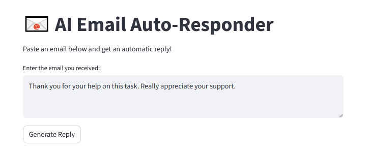
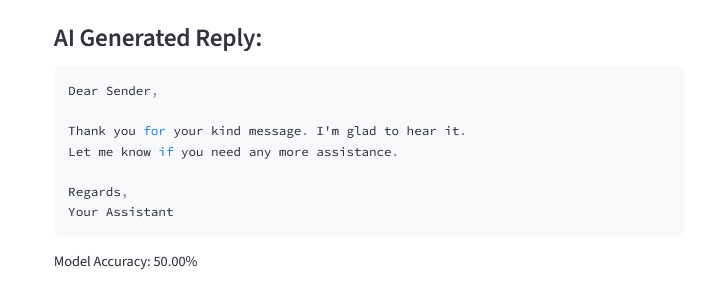

<p align="center">
  
</p>

<h1 align="center">📧 AI Email Auto-Responder</h1>

<p align="center">An AI-powered tool that analyzes email sentiment and generates automatic professional replies.</p>

---

# 📌 Features
- 🧠 Sentiment detection (Positive, Negative, Neutral, Urgent)
- 🤖 Auto-generated email replies
- 🎨 Streamlit user interface
- 📂 Custom dataset with 40 emails
- ⚡ Fast and lightweight ML model

---

# 📌 Screenshots

### 🖼️ Home Screen  
<p align="center">
  
</p>

---

### 🖼️ Sentiment Detection  
<p align="center">
  
</p>

---

### 🖼️ Auto-Generated Reply  
<p align="center">
  
</p>

---
---

# 📌 Tech Stack
- Python
- Streamlit
- Scikit-Learn
- NLTK
- Pandas
- TF-IDF Vectorizer
---

# 📌 Author
**Jahnavi Bandaru**  
AI/ML • Computer Science Engineering  
GitHub: https://github.com/jahnavibandaru2006-bot

# 📌 How to Run

```bash
pip install -r requirements.txt
streamlit run app.py
---

⭐ *If you like this project, please give it a Star on GitHub!*
